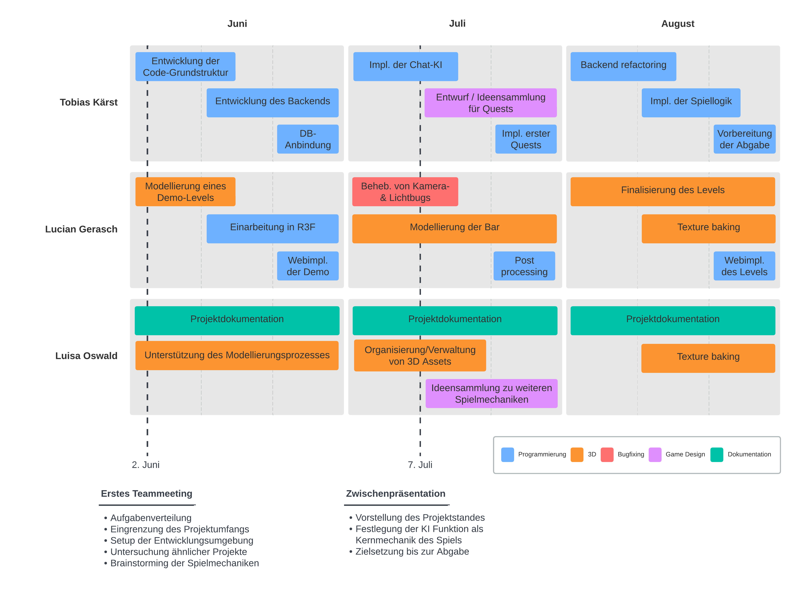
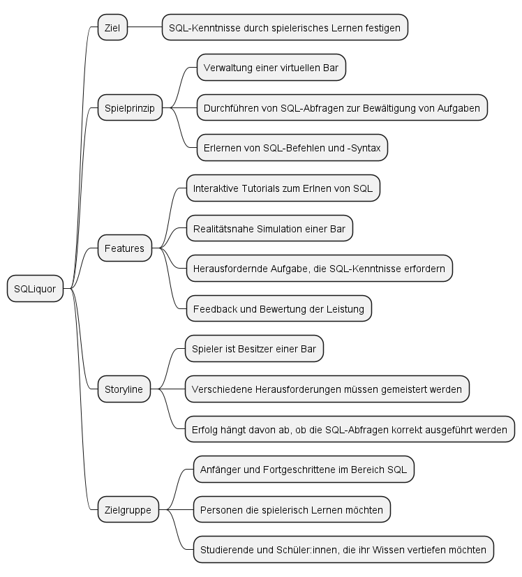
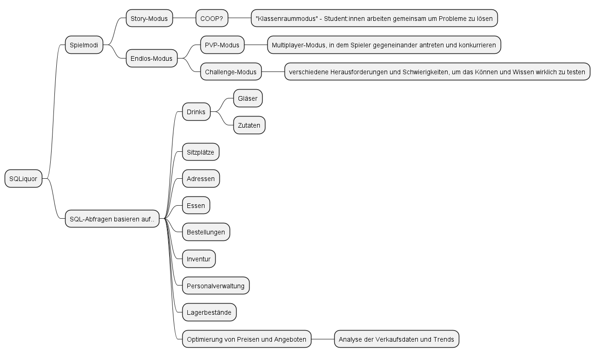

# Projektplan

| | |
|---|---|
| Mitwirkende | Lucian Gerasch, Tobias Kärst, Luisa Oswald       |
| Zielsetzung | Entwicklung einer interaktiven SQL-Lernplattform |
| Abgabedatum | 31. August 2023                                  |
| Status      | abgeschlossen                                    |

## Problemstellung
Die bestehenden Lehrmethoden im Bereich SQL und Datenbankmanagement sind oft nicht interaktiv oder ansprechend genug, um das Verständnis der Studenten zu fördern. Studenten haben Schwierigkeiten, die Grundkonzepte anhand von abstrakten SQL Aufgaben zu begreifen. Es fehlt an effektiven, praxisorientierten Lernressourcen, die den Lernprozess unterstützen und das Interesse der Studenten wecken.

## Meilensteine

## Systemanforderungen und -beschränkungen

### Muss-Kriterien
#### System
Das Spiel soll als Webapplikation implementiert werden, sodass ein einfacher Zugriff gewährt werden kann.
Die durch Spieler:innen generierten Daten müssen persistent gesichert werden.
Das Spiel muss es Spieler:innen ermöglichen den individuellen Spielfortschritt zu speichern.

#### Spielprinzip
Die Spieler:innen sollen durch die Interaktion mit einer KI unterstützt werden.
Das Spiel muss auf einen angemessenen Niveau sein, sodass sich Schüler:innen und Studierende passend herausgefordert, aber nicht überfordert werden.
Das Spiel soll einen Wiederspielwert haben.

### Wunsch-Kriterien
#### Spielprinzip
Das Spiel muss einen steigenden Schwierigkeitsgrad haben, sodass die SQL-Kenntnisse gefordert werden.
Die unterstützende KI soll davon abgehalten werden, Spieler:innen ganze Lösungen vorzuschlagen.

## Brainstorming

