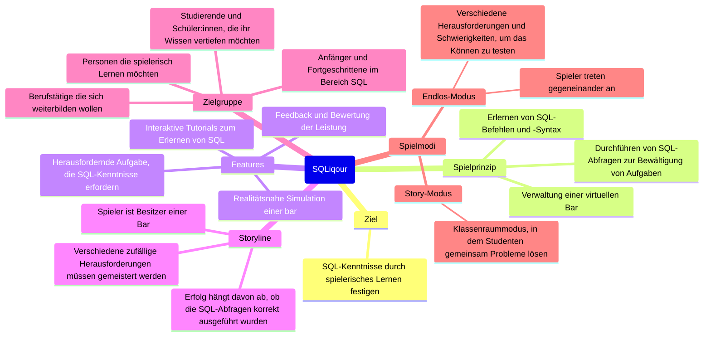

# Ideensammlung

SQL Abfragen könnten auf folgendem basieren: Drinks, Sitzplätze, Adressen, Essen, Bestellungen, Inventur, Personalverwaltung, Lagerbestände, Optimierung von Preisen und Angeboten, Analyse der Verkaufszahlen

Mögliche Events:

- Mitarbeiter feuern
- Cocktails bestellen -> Von Zutaten abziehen
- Verkäufe analysieren
- Bestellung anpassen
- Neue Zutaten bestellen
- Tageskarte erstellen
- Trigger erstellen um automatisch nachzukaufen
