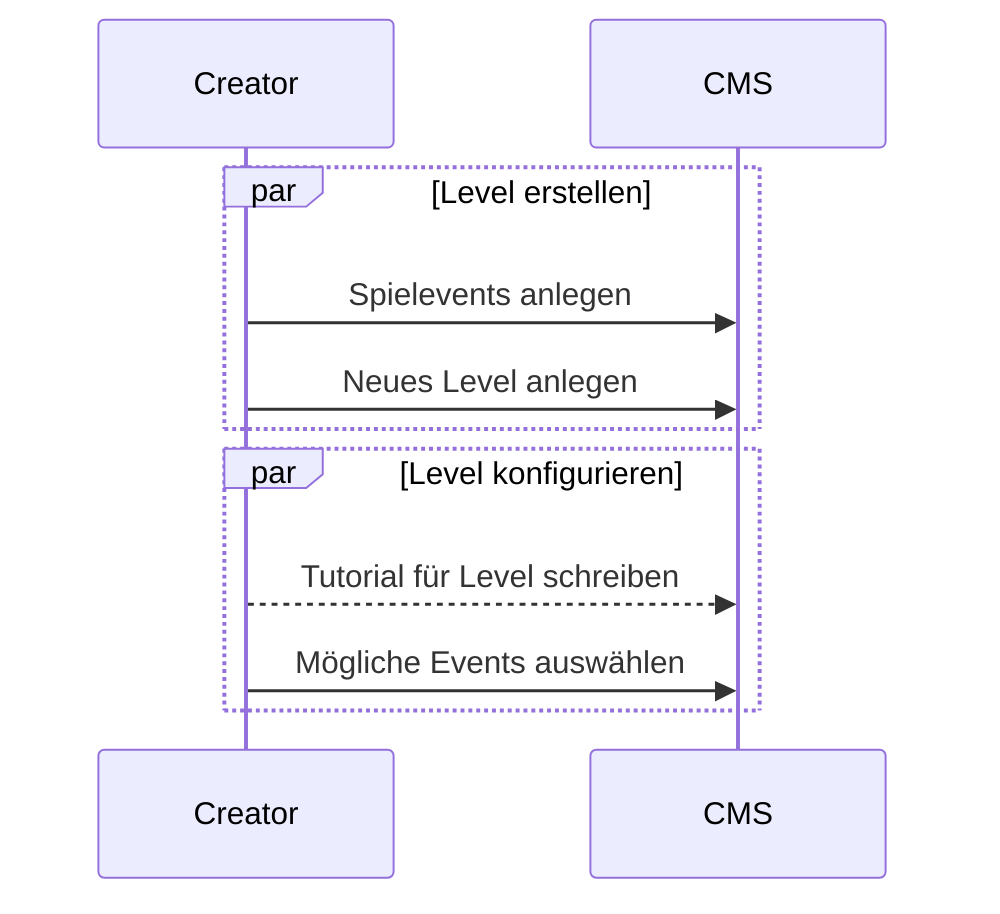
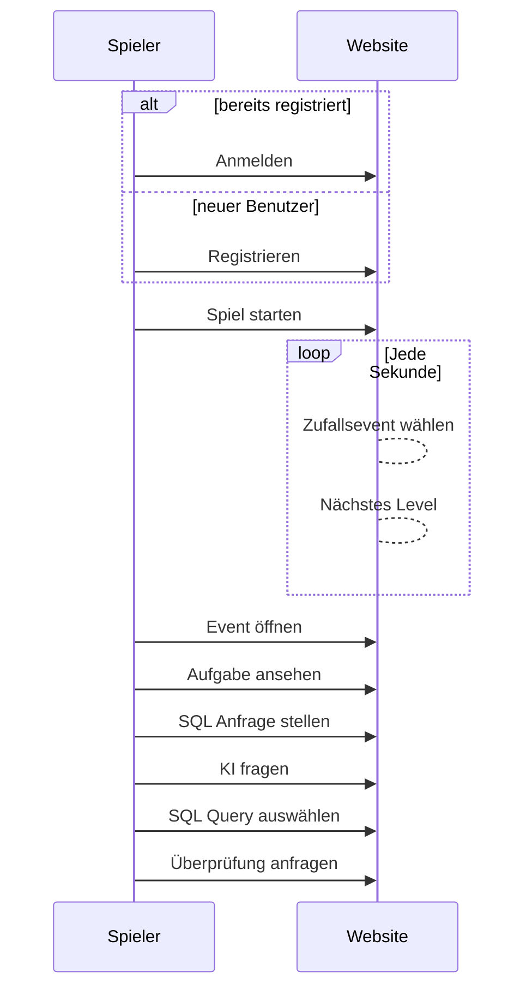

# Anwendungsfälle

Anwendungsfälle sind auf oberster Ebene direkt als Sequenzdiagramme definiert, um mögliche Abhängigkeiten zu klären und einige Prozesse bereits zu definieren (Außerdem untersützt das Diagramm Tool Mermaid.js noch keinen Anwendungsfalldiagramme :D).

Diese Diagramme stellen nicht das ganze System dar, sondern dienen lediglich dazu, einen groben Überblick über die Flows in dem System zu bekommen.

## Content Creator

## Spieler:innen

