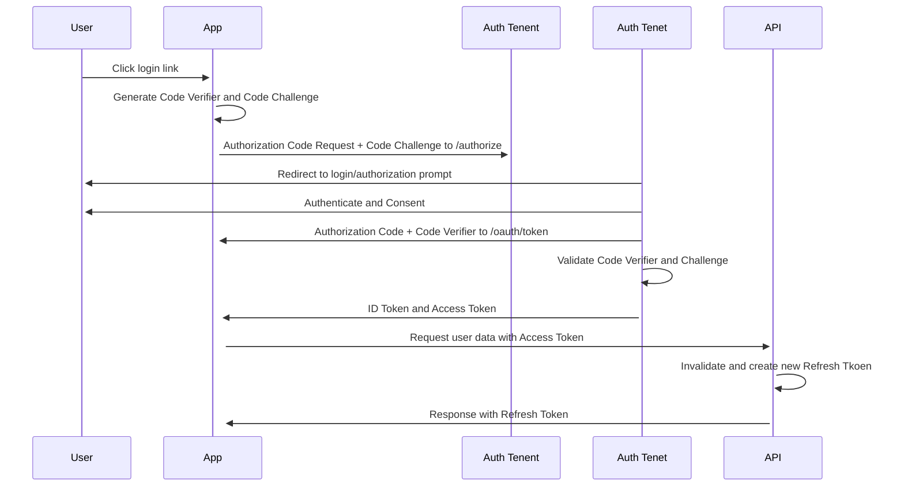

# Authentifizierung

Der PKCE führt ein von der aufrufenden Anwendung erstelltes Geheimnis ein, das vom Autorisierungsserver überprüft werden kann; dieses Geheimnis wird als Code Verifier bezeichnet. Zusätzlich erstellt die aufrufende Anwendung einen Transformationswert (Code Verifier) und sendet diesen Wert über HTTPS, um einen Autorisierungscode abzurufen. Auf diese Weise kann ein böswilliger Angreifer nur den Autorisierungscode abfangen, ihn nicht ohne den Code-Verifizierer gegen ein Token austauschen.

- Der Benutzer klickt innerhalb der Anwendung auf Login.

- Die Anwendung erstellt einen kryptographisch zufälligen code_verifier und generiert daraus eine code_challenge.

- Die Anwendung leitet den Benutzer zusammen mit der code_challenge an den Autorisierungsserver (/authorizeendpoint) weiter.

- Der Autorisierungsserver leitet den Benutzer an die Anmelde- und Autorisierungsaufforderung weiter.

- Der Benutzer authentifiziert sich mit einer der konfigurierten Anmeldeoptionen und sieht möglicherweise eine Seite mit der Auflistung der Berechtigungen.

- Ihr Autorisierungsserver speichert den code_challenge und leitet den Benutzer mit einem Autorisierungscode, der für eine einmalige Verwendung gültig ist, zurück zur Anwendung.

- Die Anwendung sendet diesen Code und den code_verifier (erstellt in Schritt 2) an den Autorisierungsserver (Endpunkt /oauth/token).

- Der Autorisierungsserver verifiziert den code_challenge und den code_verifier.

- Ihr Autorisierungsserver antwortet mit einem ID-Token und einem Zugriffstoken (und optional mit einem Refresh-Token).

- Die Anwendung kann das Zugriffstoken verwenden, um eine API aufzurufen und auf Informationen über den Benutzer zuzugreifen.

- Die API antwortet mit den angeforderten Daten.
