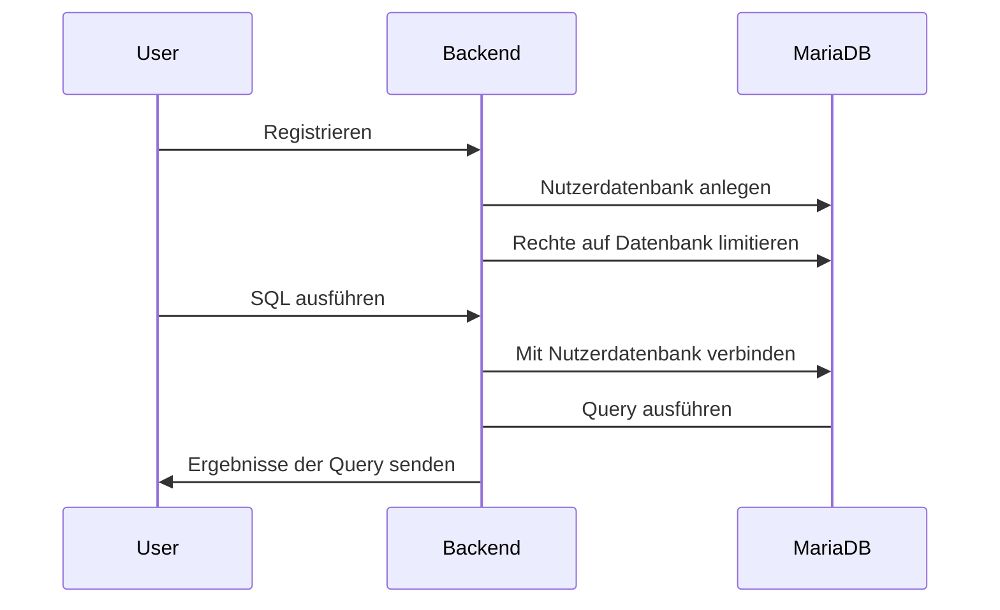
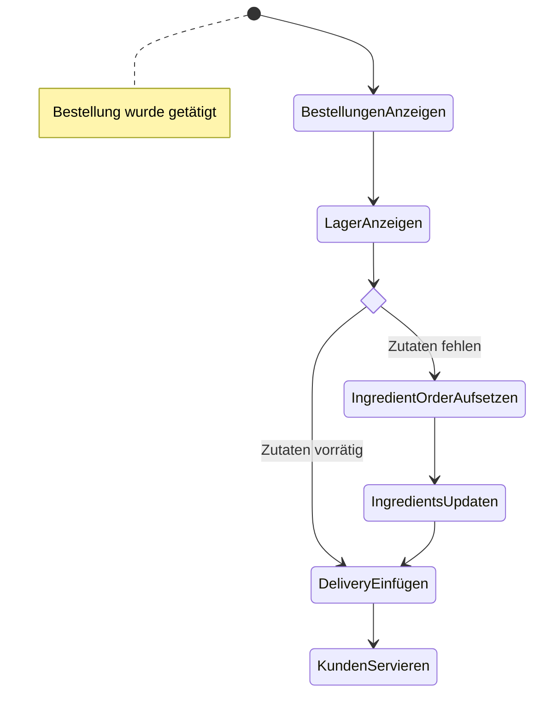

# Datenbank Engine

## Erste Idee & Probleme

Der Kernpunkt des Spiels ist es, dass jeder Benutzer richtige SQL befehle an eine eigene Datenbank stellen kann. Eine einfache und sichere Lösung wäre es gewesen, einfach SQLite im Browser laufen zu lassen. Der Nutzer könnte dann lokal mit dieser Datenbank arbeiten. Dabei gibt es nur ein Problem: SQLite verfügt über ein begrenztes Featureset im Bezug auf andere Datenbanken. Z.b. gibt es bei SQLite nicht die Möglichkeit, Prozeduren zu schreiben. Dies ist für fortgeschrittene Aufgaben jedoch zwingend notwendig. Es musste also auf eine richtige Datenbank zurück gegriffen werden.

## Lösung

Es werden eine oder mehre Instanzen einer ausgewählten Datenbank mittels Docker gestartet, in diesem Fall MariaDB. Dadurch kann man Speichernutzung, etc derart limitieren, dass Benutzer keinen Zugriff auf den Server, auf dem diese Instanzen laufen, haben. Dies hat ebenfalls den Vorteil, dass man beliebig viele Datenbanken unabhängig voneinander starten, und Nutzern zuweisen kann, falls eine nicht mehr reicht. Dabei entsteht jedoch ein neues Problem: Performance. Es ist unmöglich für jeden Nutzer eine eigene MariaDB Instanz zu starten. Zum Glück ist dies auch nicht notwendig, da innerhalb MariaDB mehrere Datenbanken existieren können. Es bekommt also jeder Nutzer seine eigene, vorgefertigte Datenbank.

Was ist aber, wenn ein Nutzer z.B. folgende Query durch Raten abschickt `DROP DATABASE <DATABASE_OF_OTHER_USER`. Er würde somit direkt das Spielerlebnis eines anderen Spielers behindert, was nicht möglich sein soll. Dieses Problem lässt sich aber relativ einfach über Nutzergruppen mit den entsprechenden Rechten lösen:

```sql
DROP DATABASE IF EXISTS {{DATABASE}};
CREATE DATABASE IF NOT EXISTS {{DATABASE}};
CREATE USER IF NOT EXISTS '{{USERNAME}}'@'%' IDENTIFIED BY '{{PASSWORD}}';

USE {{DATABASE}};

GRANT {{RIGHTS}} ON {{DATABASE}}.delivery TO '{{USERNAME}}'@'%';
GRANT {{RIGHTS}} ON {{DATABASE}}.ingredient_orders TO '{{USERNAME}}'@'%';
GRANT {{RIGHTS}} ON {{DATABASE}}.cocktail TO '{{USERNAME}}'@'%';
GRANT {{RIGHTS}} ON {{DATABASE}}.dining_table TO '{{USERNAME}}'@'%';
GRANT {{RIGHTS}} ON {{DATABASE}}.customer TO '{{USERNAME}}'@'%';
GRANT {{RIGHTS}} ON {{DATABASE}}.employee TO '{{USERNAME}}'@'%';
GRANT {{RIGHTS}} ON {{DATABASE}}.order TO '{{USERNAME}}'@'%';
GRANT {{RIGHTS}} ON {{DATABASE}}.customer_seating TO '{{USERNAME}}'@'%';
GRANT {{RIGHTS}} ON {{DATABASE}}.rating TO '{{USERNAME}}'@'%';
GRANT {{RIGHTS}} ON {{DATABASE}}.ingredient TO '{{USERNAME}}'@'%';
GRANT {{RIGHTS}} ON {{DATABASE}}.delivery_details TO '{{USERNAME}}'@'%';
GRANT {{RIGHTS}} ON {{DATABASE}}.market TO '{{USERNAME}}'@'%';
GRANT {{RIGHTS}} ON {{DATABASE}}.recipe_step TO '{{USERNAME}}'@'%';
GRANT {{RIGHTS}} ON {{DATABASE}}.cocktail_orders TO '{{USERNAME}}'@'%';
GRANT {{RIGHTS}} ON {{DATABASE}}.buys_from TO '{{USERNAME}}'@'%';
GRANT {{RIGHTS}} ON {{DATABASE}}.cocktail_ingredients TO '{{USERNAME}}'@'%';

FLUSH PRIVILEGES;
```

Wobei {{RIGHTS}} dem folgenden entspricht: `ALTER,CREATE,CREATE VIEW,DELETE,DROP,INSERT,SELECT,SHOW VIEW,TRIGGER,UPDATE`. Nach erfolgreicher Registrierung besitzt also jeder Nutzer eine eigene Datenbank, auf nur dieser Zugriff hat und auf nichts anderes. Dort kann er dann machen was er möchte.

Fragen über Sicherungen sind nicht relevant, da das Spiel Highscorebasiert läuft. Das bedeutet, zerschießt sich ein Nutzer seine Datenbank, dann muss er sich selbst drum kümmern oder es ist Game Over.

Der ganze Ablauf sieht wie folgt aus:



## ER-Modell für die Datenbank


Bei diesem Datenbank Modell muss beachtet werden, dass es sich hier nicht im statische Daten handelt. Diese Datenbank ist dafür gestaltet, den aktuellen State des Restaurants darzustellen. Bedeutet welche Kunden sind aktuell im Restaurant, welche Zutaten gibt es und so weiter.

Die Datenbank hat auch eine Besonderheit. Wird ein Cocktail bestellt, so besteht dieser aus verschiedenen Zutaten. Diese werden dem Lager entnommen. Gibt es keine Zutaten mehr, so können die Barkeeper keine Cocktails mehr mischen. Aber wer trackt die Zutaten überhaupt? Na der Benutzer! Er ist in der Verantwortung, sein Lager zu pflegen. Jetzt basiert dieses Spiel aber nicht auf Vertrauensbasis. Deswegen gibt es eine Tabelle, die automatisch vom System aktualisiert wird. Wird eine Bestellung aufgegeben, so wird kurz vor Ende mit der Systemtabelle verglichen, ob dies möglich war. Falls nicht, so kann der Cocktail nicht zubereitet werden, der Nutzer muss erst Zutaten bestellen, und kann somit vielleicht nicht rechtzeitig die Bestellung abschließen.

Dieser Automatismus wird mittels Trigger auf Delivery, IngredientOrders und Order geregelt, welche automatisch die Einträge überprüfen und in Systemtabellen vermerken.

Damit dieses Szenario besser verstanden werden kann, hier nochmal ein Diagramm zur Veranschaulichung des Bestellprozesses, um die sich der Benutzer kümmern muss.


