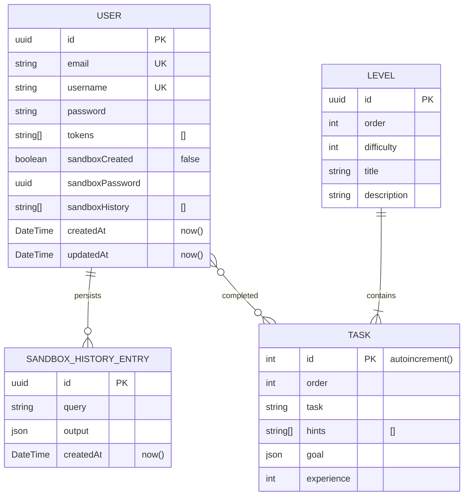
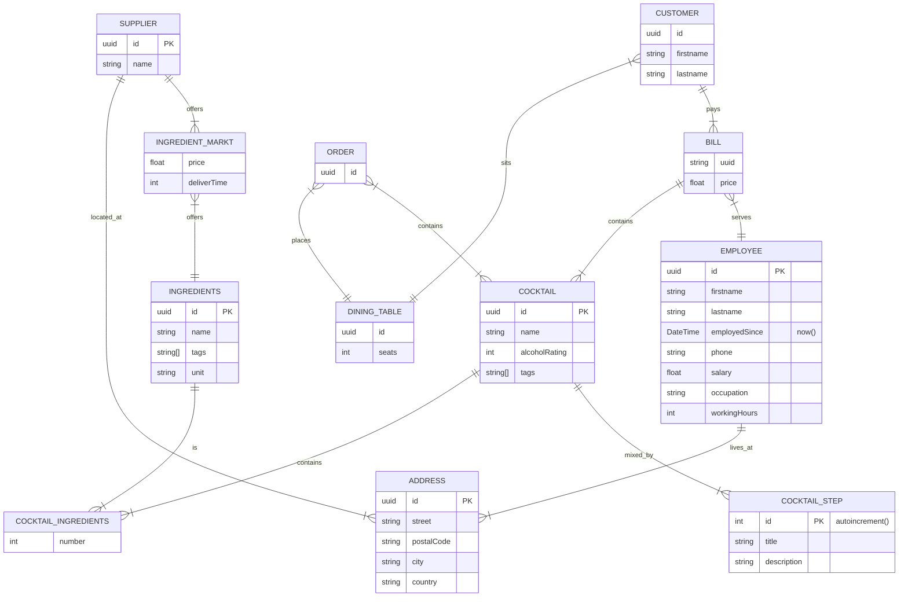

# Übersicht

Die webbasierte SQL Lernplattform SQLiquor ist ein interaktives Schulungsprogramm, das darauf abzielt, SQL-Kenntnisse durch praktische Anwendung zu entwickeln bzw. zu festigen.

- Tische

- Bewertungen
- Angebote
- bestellungen

- Lagerbestand
